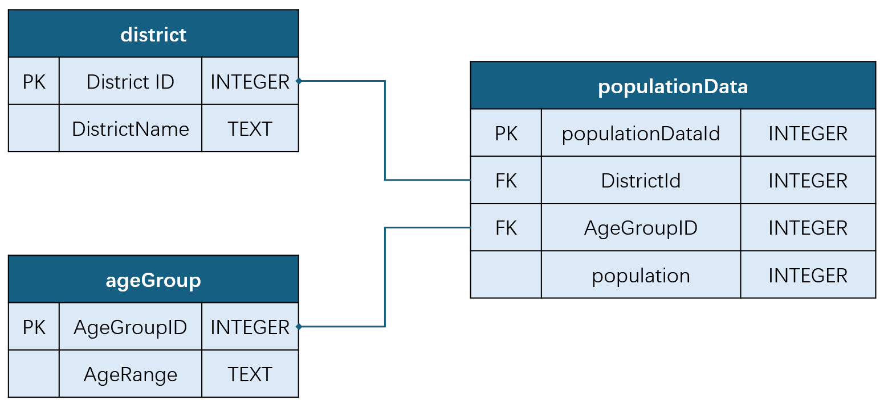

# Section1 

## data_preparation and data exploration

This code is designed for performing a detailed analysis of the population data of the United Kingdom (UK) and creating visual representations of that data.

After getting the data, I did the following steps:

1. Clean and prepare population data.
   
   first, Strips any extra whitespace from column names. 

   I use a python strip function to do this.

   And renames the columns based on a mapping.

2. Analyze population distribution across different districts in the UK.

   I use python matplotlib and created a pie chart representing the population distribution across these regions.

3. Visualize the distribution of population by gender in each district.
   
   The same to 2. Created a bar chart showing the female and male population numbers (scaled to millions) in each district.

4. Analyze and visualize the age distribution in different UK districts.

The plot result is like this:

### Population distribution of UK

My chart highlights the proportion of the population in four main districts:

England: The largest segment, comprising 84.5% of the total UK population.

Scotland: Accounting for 8.0% of the population.

Wales: Representing 4.6% of the population.

Northern Ireland: The smallest segment at 2.8%.

### Sex distribution of UK

England: Has the highest population, with approximately 29.41 million females and 28.28 million males.

Wales: A relatively smaller population with about 1.61 million females and 1.55 million males.

Scotland: Shows a balanced distribution with around 2.82 million females and 2.67 million males.

Northern Ireland: The smallest population among the districts, with approximately 0.97 million females and 0.95 million males.

### Age distribution of UK

England: Has the highest population in each age group. The population appears to peak between the "40-44" and "55-59" age groups, after which it gradually declines.

Scotland, Wales, and Northern Ireland: Show similar trends but at much smaller scales. 

Their population lines remain relatively flat compared to England, indicating less variation in the age distribution.

The plot highlights the significant difference in population size between England and the other districts.
The age distribution in England suggests a sizable portion of the population is middle-aged (between "40-59").

The decreasing trend in all districts as age increases indicates fewer older individuals compared to younger and middle-aged groups.

# Section2

## Database design and creation

Based on the raw dataset, I build a database. The database design is like below:

Tables and Attributes:

### district Table

Primary Key (PK): District ID (INTEGER) – A unique identifier for each district.

Attribute: DistrictName (TEXT) – The name of the district (e.g., England, Scotland).

### ageGroup Table

Primary Key (PK): AgeGroupID (INTEGER) – A unique integer for each age group.

Attribute: AgeRange (TEXT) – The range of ages in the group (e.g., "0-4", "5-9").

### populationData Table:

Primary Key (PK): populationDataId (INTEGER) – A unique integer for each record in the population data.

Foreign Key (FK): DistrictId (INTEGER) – References District ID in the district table.

Foreign Key (FK): AgeGroupID (INTEGER) – References AgeGroupID in the ageGroup table.

Attribute: population (INTEGER) – The number of people in the specified district and age group.

